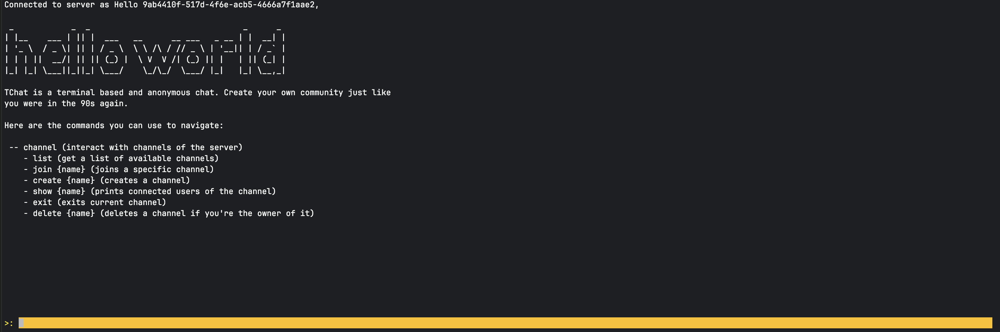
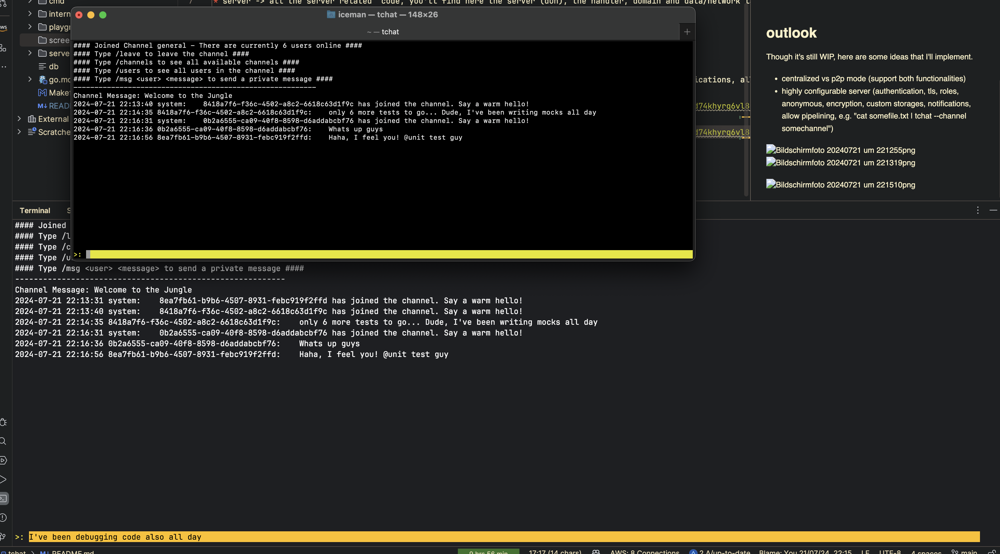

# tchat - A retro chat from the 90s

tchat is a terminal-based chat application.
No fancy GUI. You can use the terminal (e.g. from your IDE) to connect to a tchat server and start talking immediately.

## current state

Right now, the server is able to understand the following commands:

* /channel list
* /channel join <channel>
* /channel create <channel>
* /leave (while being in channel)
* exit

Further, some internal commands are available such as connect, disconnect, channel_new_message.
Clients can connect to the server, list all channels and join existing ones. Once a user connected to a channel, he
can then type messages and submit it so it will be broadcasted by the server to all clients that are inside the channel.
There is no persistence yet, so once the server is stopped, all messages are lost.

## architecture

I'm using some sort of a hexagonic architecture for the client and the server.

* server -> all the server related code, you'll find here the server (duh), the handler, domain and data/network layers.
  The domain will include the business logic and data will take care of connection management, writing/reading to
  storages
* client -> analog to server, the client contains mostly command parsing

## outlook

Though it's still WIP, here are some ideas that I'll implement.

* centralized vs p2p mode (support both functionalities)
* highly configurable server (authentication, tls, roles, anonymous, encryption, custom storages, notifications, allow
  pipelining, e.g. "cat somefile.txt | tchat --channel somechannel")

## how to run

* prepare two terminals (one for server, one for your client)
* first run the server by running in your first terminal `make run-server`
* then run the client by running `make run-client`

Currently, at this moment there is no database attached to the server (you can implement your own SQL wrapper within
server/data/channelrepository.go)
so the whole servers state is in-memory and will be lost after you stop the server.
There is currently only one channel available, which is called "general". You can connect to the channel from the client
by typing `/channel join general`.
Creating and deleting channels is not yet implemented.

